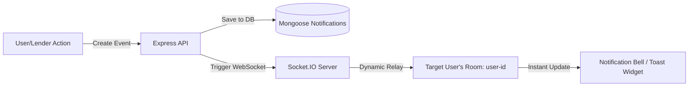

# BikeRentLelo — System Architecture & Tech Stack Reference Guide

Welcome to the architectural guide for **BikeRentLelo**, a high-end, real-time rental platform for electric scooters, motorbikes, and bicycles in India. This document outlines the technology stack, system design, data flows, database schemas, and advanced engineering workflows utilized in the project.

---

## 1. High-Level System Architecture

BikeRentLelo uses a **decoupled Client-Server architecture** (MERN stack) enhanced with real-time WebSockets, AI capability, map rendering, and payment processing.

```mermaid
graph TD
    %% Clients
    subgraph Client Layer [React & Tailwind CSS Frontend]
        User[User Portal]
        Lender[Lender / Vendor Dashboard]
        Agent[Delivery Agent Dashboard]
        Admin[Admin Control Center]
    end

    %% Router & Networking
    ClientLayer -->|HTTPS (Axios) / WSS (Socket.io-client)| API_Gateway[Vite Dev Server / Express API]

    %% Backend Server
    subgraph Server Layer [Node.js & Express Backend]
        AuthCtrl[Auth Controller & OTP Verification]
        VehiclesCtrl[Geospatial Vehicle Catalog]
        BookingCtrl[Booking Engine]
        ChatCtrl[Socket.IO Chat & Notifications]
        AICtrl[Groq AI Agent / LLaMA Engine]
        DeliveryCtrl[Delivery Dispatcher]
    end

    API_Gateway --> AuthCtrl
    API_Gateway --> VehiclesCtrl
    API_Gateway --> BookingCtrl
    API_Gateway --> ChatCtrl
    API_Gateway --> AICtrl
    API_Gateway --> DeliveryCtrl

    %% Databases & External Services
    subgraph Database & Storage
        DB[(MongoDB / Mongoose ODM)]
        FS[Local File Storage / Multer]
    end

    subgraph External Services
        Razorpay[Razorpay Payment API]
        Groq[Groq LLaMA Cloud API]
        SMTP[Gmail SMTP Server]
    end

    %% Connections
    AuthCtrl -->|Store Session / Hash| DB
    AuthCtrl -->|Send OTP| SMTP
    VehiclesCtrl -->|Fetch Catalog| DB
    VehiclesCtrl -->|Upload Images| FS
    BookingCtrl -->|Process Orders / Track Rides| DB
    BookingCtrl -->|Create Order| Razorpay
    ChatCtrl -->|Save Chat History| DB
    AICtrl -->|Prompt / JSON LLaMA Model| Groq
    DeliveryCtrl -->|Assign & Dispatch Agents| DB
```

---

## 2. The Frontend Technology Stack

The client-side application is built for speed, responsiveness, and premium visual aesthetics.

### Key Frontend Technologies
1. **React 19 (`react`, `react-dom`)**
   * **What it is**: A declarative, component-based Javascript library for building interactive user interfaces.
   * **Why it's used**: Renders dynamic components, manages local/global state efficiently, and handles dynamic routing.
   * **Official Docs**: [React Documentation](https://react.dev/)

2. **Vite 8 (`vite`, `@vitejs/plugin-react`)**
   * **What it is**: A next-generation, ultra-fast frontend build tool and development server.
   * **Why it's used**: Replaces slower bundlers like Webpack, offering instant Hot Module Replacement (HMR) and highly optimized production builds.
   * **Official Docs**: [Vite Documentation](https://vite.dev/)

3. **Tailwind CSS 4 (`tailwindcss`, `@tailwindcss/vite`)**
   * **What it is**: A utility-first CSS framework for rapid UI styling.
   * **Why it's used**: Enables styling, responsive grids/flexbox, transitions, and dark modes directly inside HTML markup.
   * **Official Docs**: [Tailwind CSS Documentation](https://tailwindcss.com/)

4. **React Router DOM 7 (`react-router-dom`)**
   * **What it is**: The standard routing library for React.
   * **Why it's used**: Enables Single Page Application (SPA) navigation across different dashboards (User, Lender, Delivery Agent, Admin) without full-page reloads.
   * **Official Docs**: [React Router Documentation](https://reactrouter.com/)

5. **Leaflet & React Leaflet 5 (`leaflet`, `react-leaflet`)**
   * **What it is**: A lightweight, open-source mobile-friendly interactive mapping library.
   * **Why it's used**: Displays available vehicles on a map, plots delivery routes, and renders live, moving markers for GPS tracking of delivery agents and riders.
   * **Official Docs**: [React Leaflet Docs](https://react-leaflet.js.org/) | [Leaflet.js Docs](https://leafletjs.com/)

6. **Axios (`axios`)**
   * **What it is**: A promise-based HTTP client for making API requests to the backend server.
   * **Why it's used**: Handles authorization header injection (`Bearer Token` from `localStorage`), custom timeouts, and error handling.
   * **Official Docs**: [Axios Documentation](https://axios-http.com/)

7. **Socket.io-client (`socket.io-client`)**
   * **What it is**: The frontend client SDK for real-time WebSockets.
   * **Why it's used**: Connects to the backend WebSocket server to emit and receive instant chat messages, live delivery statuses, and GPS location streams.
   * **Official Docs**: [Socket.IO Client Docs](https://socket.io/docs/v4/client-api/)

---

## 3. The Backend Technology Stack

The backend services are designed for heavy workloads, real-time events, security, and smart integration.

### Key Backend Technologies
1. **Node.js & Express 5 (`express`)**
   * **What it is**: A lightweight web server framework running on the V8 Javascript engine.
   * **Why it's used**: Serves RESTful APIs, handles request routing, manages JWT authentication middlewares, and serves static vehicle uploads.
   * **Official Docs**: [Express.js Documentation](https://expressjs.com/)

2. **MongoDB & Mongoose 9 (`mongoose`)**
   * **What it is**: A schema-based Object Data Modeling (ODM) library for MongoDB.
   * **Why it's used**: Maps javascript objects to MongoDB collections with validation (e.g. schemas for Users, Vehicles, Bookings, Messages, and Notifications).
   * **Official Docs**: [Mongoose Documentation](https://mongoosejs.com/)

3. **Socket.IO (`socket.io`)**
   * **What it is**: A robust WebSocket library for bidirectional event-driven communication.
   * **Why it's used**: Manages live server connections, coordinates private messaging channels between users and lenders, and broadcasts active ride coordinates from riders to observers.
   * **Official Docs**: [Socket.IO Server Docs](https://socket.io/docs/v4/server-api/)

4. **Groq SDK / OpenAI SDK (`openai`)**
   * **What it is**: Client SDK connecting to high-speed AI inference models.
   * **Why it's used**: Accesses the high-speed LLaMA-3.1-8B model on Groq Cloud to process smart vehicle recommendations, dynamic pricing suggestions, and interactive AI chat support.
   * **Official Docs**: [Groq API Documentation](https://console.groq.com/docs) | [OpenAI API Docs](https://platform.openai.com/docs)

5. **Razorpay Node SDK (`razorpay`)**
   * **What it is**: Developer SDK for India's popular Razorpay payment gateway.
   * **Why it's used**: Generates secure checkout orders on the server-side, enabling clients to pay securely via UPI, Credit Cards, or Netbanking, and verifies payment signatures.
   * **Official Docs**: [Razorpay Node SDK](https://razorpay.com/docs/payments/server-integration/nodejs/payment-gateway/)

6. **Multer (`multer`)**
   * **What it is**: Middleware for handling `multipart/form-data` file uploads.
   * **Why it's used**: Uploads vehicle listing photographs and user KYC verification documents (Aadhaar/DL) securely to local server disk storage.
   * **Official Docs**: [Multer GitHub](https://github.com/expressjs/multer)

7. **Brevo Transactional Email API (`sib-api-v3-sdk`)**
   * **What it is**: High-deliverability transactional email service.
   * **Why it's used**: Replaces standard SMTP to distribute security OTPs during registration/login and booking receipts reliably and quickly without standard spam filters blocking them.
   * **Official Docs**: [Brevo API Documentation](https://developers.brevo.com/)

---

## 4. Key Architectural Workflows & Implementation

### A. The Real-Time Live Location Tracking & Ride Metrics System
This is one of the most advanced engineering elements in the project, facilitating real-time telemetry streaming and ride metrics recording.

1. **Client Broadcast**: When a ride or delivery starts, the client uses the browser's Geolocation API (`navigator.geolocation.watchPosition`) to capture latitude, longitude, and current speed at frequent intervals.
2. **Socket Transmission**: The coordinates are packaged and emitted over Socket.IO:
   ```javascript
   socket.emit('rider-location', { bookingId, lat, lng, speed });
   ```
3. **Room Relay**: The backend server receives the event and relays the location exclusively to the sockets subscribed to that specific room (`booking-${bookingId}`):
   ```javascript
   socket.on('rider-location', ({ bookingId, lat, lng, speed }) => {
     socket.to(`booking-${bookingId}`).emit('location-update', { lat, lng, speed });
   });
   ```
4. **Telemetry Saving & Replay (`routeHistory`)**:
   In `Booking.js`, the schema keeps track of the vehicle's telemetry. This lets users replay their full ride routes with detailed speeds on a Leaflet map:
   ```javascript
   routeHistory: [{
     lat: Number,
     lng: Number,
     speed: Number,
     timestamp: { type: Date, default: Date.now }
   }]
   ```

---

### B. Proximity Location Searches (Geospatial Approximation)
To help customers find vehicles nearby without full geospatial database indexes, the system implements a custom bounding-box approximation.

```javascript
if (lat && lng) {
  // 1 degree latitude/longitude is roughly equal to 111 kilometers
  const distanceDeg = (Number(radius) || 50) / 111; 
  query['locationCoordinates.lat'] = { 
    $gte: Number(lat) - distanceDeg, 
    $lte: Number(lat) + distanceDeg 
  };
  query['locationCoordinates.lng'] = { 
    $gte: Number(lng) - distanceDeg, 
    $lte: Number(lng) + distanceDeg 
  };
}
```
This efficiently crops the database results using coordinate range checking, allowing instant loading of nearby vehicles.

---

### C. Advanced AI Automation Engine (Groq LLaMA-3.1)
The application leverages Groq's high-speed API to implement three smart core features in `aiController.js`:

1. **Smart Price Recommendation**:
   Analyzes the vehicle type, brand, location, battery range, and description to output an ideal market-based hourly and daily price in INR formatted directly as valid, parseable JSON:
   ```javascript
   const completion = await groq.chat.completions.create({
     messages: [{ role: 'user', content: prompt }],
     model: 'llama-3.1-8b-instant',
     temperature: 0.2,
     response_format: { type: 'json_object' }
   });
   ```
2. **Fleets Context-Driven Recommendations**:
   Passes the names, ranges, and ratings of all *currently available* vehicles to the AI prompt context, along with a user's natural language search query (e.g. *"I need a cheap electric scooter to travel 80km"*). The AI selects the 1–3 best matching models and provides an explanation, matching them dynamically using exact database IDs.

---

### D. Secure Database Network Workaround
An important database workaround is implemented in `backend/config/db.js` to ensure stability across complex DNS and network environments:
```javascript
const dns = require('dns');
// Set custom DNS resolvers to avoid Node.js DNS SRV query failures (ECONNREFUSED) with MongoDB Atlas
dns.setServers(['8.8.8.8', '8.8.4.4']);
```
This sets the Node runtime to resolve MongoDB connection URIs via Google's Public DNS instead of standard ISP servers, resolving common database timeout failures.

---

### E. Decentralized Delivery Orchestration Lifecycle (Uber-Style)
Deliveries utilize an advanced decentralized claiming workflow, shifting assignment power from admins to the agents themselves:
1. **Global Pool & Real-Time Broadcasts**: When a user selects delivery, the unassigned booking enters a global pool. It appears instantly on the "Available" tab of all Delivery Agents.
2. **Claiming Engine**:
   - An agent can click **Reject**, adding their ID to a `rejectedByDeliveryAgents` schema array. This hides the delivery locally without affecting other agents.
   - An agent can click **Accept**, locking the delivery to their account. The backend immediately fires a `delivery-claimed` Socket.IO event, which causes the request to instantly vanish from all other agents' screens in real-time.
3. **Transit & Live Notifications**:
   $$\text{assigned} \longrightarrow \text{out\_for\_delivery} \longrightarrow \text{delivered} \longrightarrow \text{pickup\_scheduled} \longrightarrow \text{picked\_up} \longrightarrow \text{completed}$$
   At every state change, the backend simultaneously emits a `delivery-update` Socket.IO event to **both the Renter and the Lender**, creating a fully synchronized ecosystem.
4. **Tracking**: The agent's dashboard provides simple one-click buttons to cycle states and includes deep Google Maps integration:
   ```html
   <a href="https://www.google.com/maps/dir/?api=1&destination=lat,lng" target="_blank">View on Maps</a>
   ```

---

## 5. Razorpay Payments & Wallets Architecture

The payment architecture utilizes a dual client-server validation system to prevent order tampering and balance discrepancies:

```text
  [ RENTER ]                      [ BACKEND SERVER ]             [ RAZORPAY GATEWAY ]
      │                                   │                                │
      ├──── 1. Request Booking ──────────►│                                │
      │    (Check duration & costs)       ├──── 2. Create Order ──────────►│
      │                                   │    (Initiate secure transaction)│
      │◄──────────────────────────────────┼──── 3. Returns orderId ◄───────┤
      │                                   │                                │
      ├──── 4. Open Razorpay Widget ──────┼───────────────────────────────►│
      │    (User executes payment)        │                                │
      │◄──────────────────────────────────┼─── 5. Returns payment details ─┤
      ├──── 6. Send verification request ─►│                                │
      │    (Payload + Signatures)         ├──── 7. Verify Signature ───────┤
      │                                   │    (SHA-256 HMAC Verification) │
      │                                   ├──── 8. Complete Booking & ────┤
      │                                   │      Update Wallet Balances    │
      │◄─── 9. Confirm Success ───────────┤                                │
```

### Order Creation & Signature Verification
1. **Server Validation**: When a booking is requested, the backend calculates the exact billing parameters based on duration, vehicle rates, and delivery options, then requests a unique Order ID from Razorpay's API:
   ```javascript
   const order = await razorpay.orders.create({
     amount: totalAmount * 100, // Amount in Indian Paise
     currency: "INR",
     receipt: `receipt_booking_${bookingId}`
   });
   ```
2. **Signature Verification**: Once payment is completed on the client's screen, the widget returns a checkout payload containing the `razorpay_payment_id`, `razorpay_order_id`, and `razorpay_signature`. The backend verifies the integrity of this payload using a SHA-256 HMAC signature check:
   ```javascript
   const crypto = require('crypto');
   const generatedSignature = crypto
     .createHmac('sha256', process.env.RAZORPAY_KEY_SECRET)
     .update(`${razorpayOrderId}|${razorpayPaymentId}`)
     .digest('hex');
   
   if (generatedSignature !== razorpaySignature) {
     throw new Error("Payment signature verification failed");
   }
   ```

---

## 6. Notifications & Peer-to-Peer Chat Architecture

The notification system connects user activity to in-app alerts and real-time updates.



### Action Dispatcher Lifecycle
* **Dynamic Event Channels**: Alerts are processed by a dedicated utility function, `sendNotification`, which automatically creates a permanent record in the database and broadcasts the update immediately if the user is online:
  ```javascript
  const sendNotification = async (app, { recipient, type, title, content, link }) => {
    // 1. Create a persistent notification record in MongoDB
    const notification = await Notification.create({ recipient, type, title, content, link });
    
    // 2. Query the Socket.IO instance attached to the Express app
    const io = app.get('io');
    if (io) {
      // 3. Emit the notification directly to the user's private channel
      io.to(`user-${recipient}`).emit('new-notification', notification);
    }
  };
  ```

---

## 7. Unified Summary Matrix for Easy Learning

| Feature / System | Frontend Technology | Backend Service / Module | Database Model | Protocol / API |
| :--- | :--- | :--- | :--- | :--- |
| **Authentication** | `Login.jsx` / Axios | `authController.js` / `bcryptjs` | `User` Schema | HTTP (POST) |
| **Vehicle Search** | `VehicleListing.jsx` | `vehicleRoutes.js` (Geospatial Box) | `Vehicle` Schema | HTTP (GET) |
| **Payments** | `BookingFlow.jsx` | `bookingRoutes.js` / `razorpay` | `Booking` Schema | Razorpay API |
| **Map Rendering** | Leaflet / React-Leaflet | Static uploads | `Vehicle` Schema | OSM Map Tiles |
| **Live Tracking** | `BookingTracking.jsx` | `server.js` (Socket rooms) | `Booking` Schema (`routeHistory`) | WebSockets (Socket.IO) |
| **Peer Chat** | `ChatWidget.jsx` | `server.js` (`send-message` event) | `Message` / `Notification` | WebSockets (Socket.IO) |
| **AI Support** | `AIChatWidget.jsx` | `aiController.js` (Groq SDK) | Context lists | Groq REST API |
| **Delivery Pipelines** | `DeliveryAgentDashboard.jsx` | `deliveryRoutes.js` | `Booking` / `User` | HTTP (PUT) |
